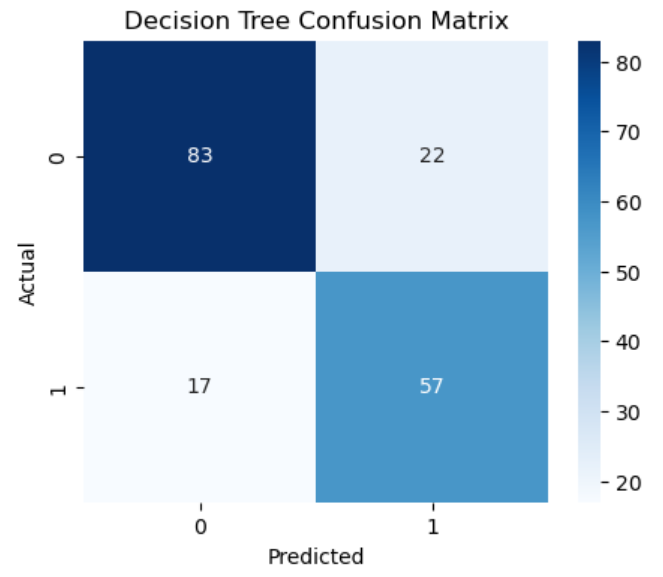
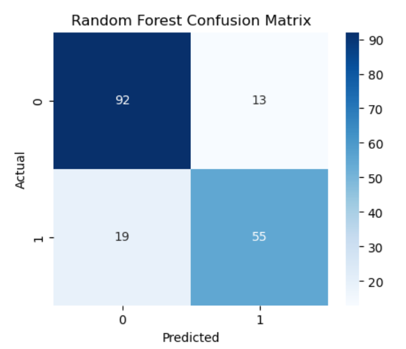
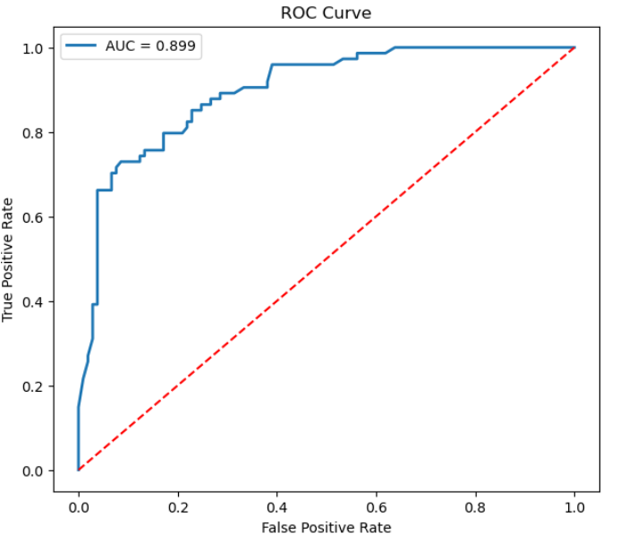
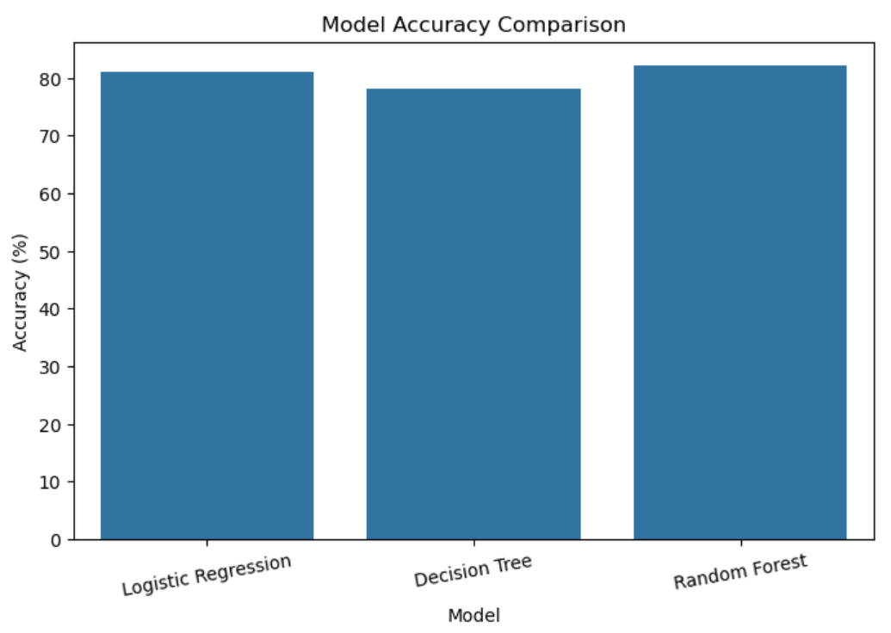

# 🤖 Predictive Modeling Using Machine Learning

## 📌 Project Overview

This project demonstrates the development of predictive machine learning models using the Titanic dataset. Multiple supervised learning algorithms were trained and evaluated to predict passenger survival. The models were compared using various evaluation metrics to identify the best-performing algorithm.

## 🎯 Objective

- Build predictive machine learning models
- Compare different supervised learning algorithms
- Evaluate model performance
- Visualize model results
- Gain hands-on experience in predictive analytics

## 📂 Dataset Used

**Dataset:** Titanic Dataset

**Source:** Kaggle
https://www.kaggle.com/c/titanic/data

## 🛠️ Technologies Used

- Python
- Pandas
- NumPy
- Matplotlib
- Seaborn
- Scikit-learn
- Jupyter Notebook

## 🤖 Machine Learning Models

- Logistic Regression
- Decision Tree Classifier
- Random Forest Classifier

## ✨ Key Features

- Data Cleaning
- Feature Engineering
- Train-Test Split
- Model Training
- Model Evaluation
- Accuracy Comparison
- Confusion Matrix
- ROC Curve
- Classification Report

## 📊 Evaluation Metrics

- Accuracy
- Precision
- Recall
- F1-Score
- ROC-AUC Score
  
## 📷 Project Screenshots

### Confusion Matrix

### ROC Curve

### Accuracy Comparison

## 📈 Key Findings

- Random Forest achieved the highest prediction accuracy.
- Decision Tree provided good interpretability.
- Logistic Regression served as a strong baseline model.
- ROC Curve demonstrated the classification capability of the models.
- Confusion Matrix highlighted correct and incorrect predictions.

## 📓 Notebook
https://github.com/priya666rout-lab/-Predictive-Modeling-Using-Machine-Learning/blob/main/thiranex2.ipynb

## 🚀 Repository
https://github.com/priya666rout-lab/-Predictive-Modeling-Using-Machine-Learning

## 👩‍💻 Author

**Priya Rout**
B.Tech Computer Science & Engineering (Data Science)
Passionate about Data Science, Machine Learning, and Data Analytics.
